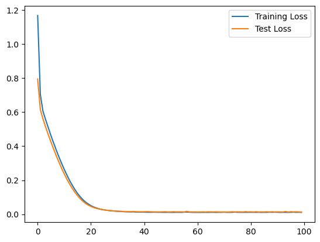
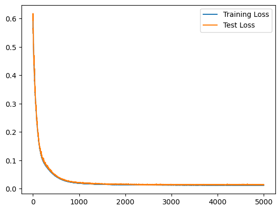
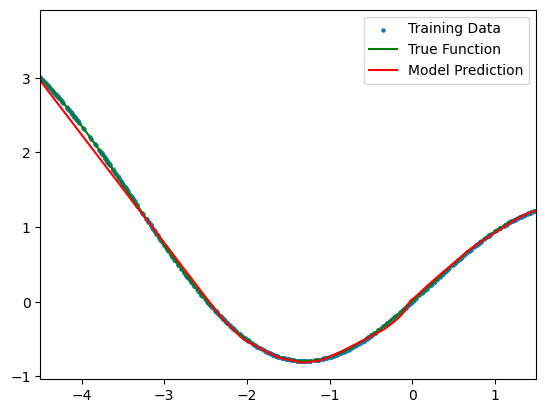

# 基于 ReLU 神经网络拟合函数

## 1. 实验目的

本次实验旨在利用基于 ReLU 激活函数的神经网络拟合自定义函数。通过自行采样生成训练集和测试集，使用训练集对网络进行训练，并利用测试集验证拟合效果，从而掌握数据采集、模型构建、参数训练以及模型评估的完整流程。

## 2. 函数定义

本实验中拟合的目标函数定义为：
  
$$
f(x)=\sin(x)+0.1x^2
$$

该函数结合了正弦函数的周期性和二次函数的抛物线趋势，呈现出较为复杂的非线性关系，是回归问题中常用的测试函数之一。

## 3. 数据采集

为训练和验证模型，我们对目标函数进行了数据采样：

- **训练集**：从区间 \([-5,5]\) 内使用均匀随机采样生成 1000 个样本数据。随机采样可以更好地覆盖输入空间中的随机性。
- **测试集**：使用区间 \([-5,5]\) 上的均匀采样生成 200 个样本数据，保证曲线平滑，从而方便直观地对比模型预测结果与真实函数曲线。

## 4. 模型描述

### 4.1 网络结构

本实验采用了两层神经网络，其中包含：

- **输入层**：输入维度为 1（即单个变量 x）。
- **隐藏层**：包含 64 个神经元，采用 ReLU 激活函数。ReLU 激活函数具有计算简单且能缓解梯度消失问题的优点。
- **输出层**：1 个神经元，采用线性激活，用于回归任务输出连续值。

### 4.2 实现方式

实验中提供了两种实现方式：

1. **基于 TensorFlow 的实现**  
   使用 Keras 构建 `Sequential` 模型，调用内置的 `Dense` 层和 `Adam` 优化器，利用均方误差（MSE）作为损失函数。训练过程中利用测试数据作为验证集，实时观察训练和测试损失的变化。

2. **基于 NumPy 的手动实现**  
   通过手动实现前向传播、反向传播和参数更新的过程，采用 He 初始化权重，并使用梯度下降法对网络参数进行优化。每个 epoch 内部使用小批量数据进行参数更新，并定期计算训练集和测试集的 MSE 损失。

两种方式均成功拟合了目标函数，验证了使用 ReLU 神经网络解决回归问题的可行性。

## 5. 拟合效果

### 5.1 损失曲线

在训练过程中，通过记录训练和测试集的均方误差损失，可以观察到模型的收敛情况。随着 epoch 增加，训练损失和测试损失逐渐下降，表明模型逐步学习到了目标函数的模式。

    
     
    
loss_tensorflow

    
     
    
loss_numpy

### 5.2 预测结果

对比真实函数曲线与模型预测曲线的结果显示，模型能够较好地捕捉目标函数的非线性变化。以下是两种实现方式对应的可视化结果示例：

- **散点图**：展示了训练数据的分布。
- **曲线图**：绿色曲线表示真实的目标函数；红色曲线表示模型预测结果。

    
     
    
result_tensorflow

    
     
    
result_numpy

从图中可以看出，模型预测曲线与真实函数曲线高度重合，说明网络已经较好地拟合了目标函数。

---

## 6. 结论

本次实验通过两种实现方式验证了基于 ReLU 神经网络对非线性回归问题的有效性。数据采集、模型构建、训练过程以及最终拟合效果均证明，该方法能够成功捕捉到函数的复杂非线性关系。对于实际问题，可进一步调节网络结构、优化参数及训练策略，以获得更高精度的拟合结果。